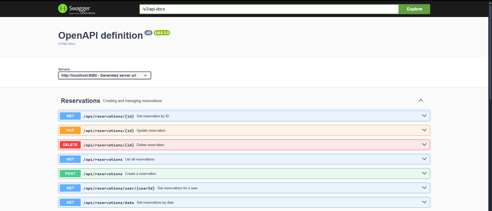
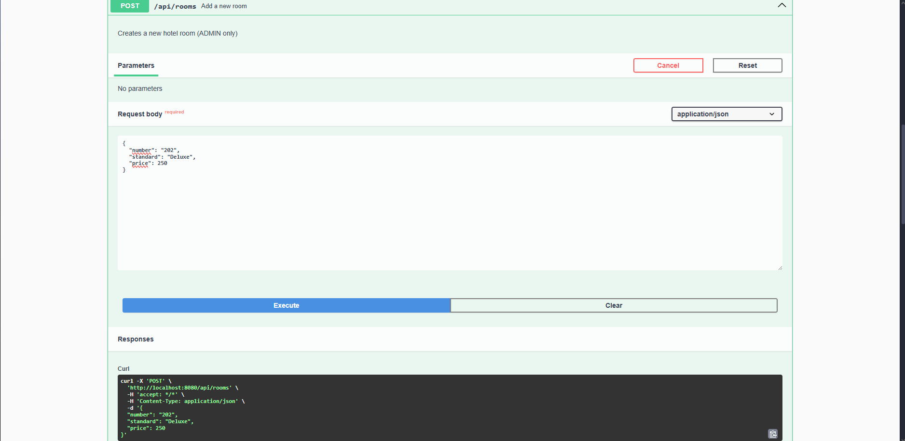
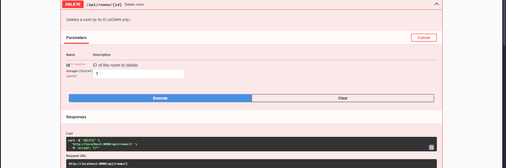
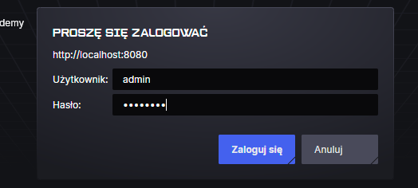
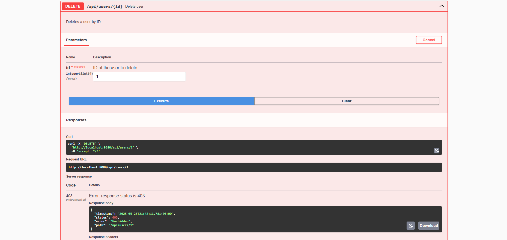
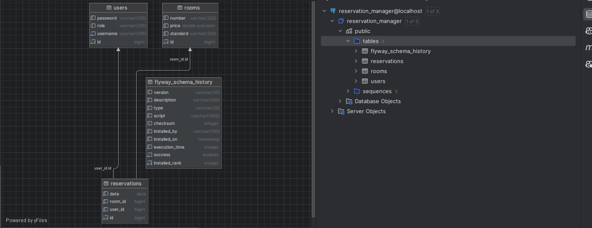
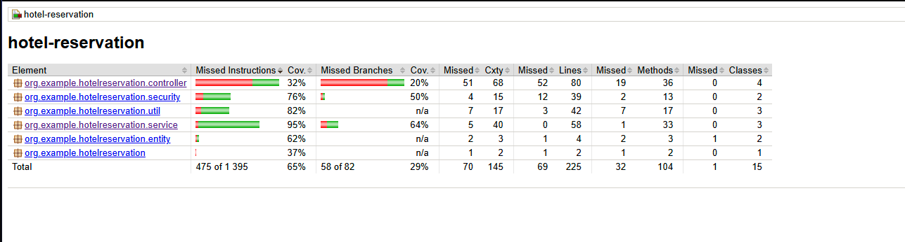

# Hotel Reservation Manager

Web application for managing hotel reservations - users can browse and book available rooms.  
Admin can do everything - register new users, add rooms, manage reservations, etc.

## 1. Requirements:

- **Docker** and **Docker Compose** installed
- (Optional) **Java 21** and **Maven** installed – only if you want to build `.jar` manually

## 2. How to run:

- Clone the repository:
```bash
git clone https://github.com/Zorquan04/hotel-reservation-manager.git
```

- Build and run the application using Docker Compose:
```bash
mvn clean package
docker-compose build
docker-compose up
```

## 3. How to access (by Swagger UI):

Go to: http://localhost:8080/swagger-ui/index.html#/

Then you have to log in - by default, there are two accounts:  
- usename: admin, password: admin123  
- username: user, password: user123

## 4. How tu use:

For now you should have something like this:


For example to create a new room (as admin), you can use the following request:


To delete:


Any other requests can be done **in a similar way**, just check the Swagger UI.

## 5. Implementation of project requirements:

1. **Git Repository** - you are reading it right now so ✅


2. **Docker** - the application is containerized using Docker and Docker Compose ✅  
[See docker-compose.yml](docker-compose.yml)  
[See Dockerfile](Dockerfile)


3. **Maven** - the project is built using Maven ✅  
[See pom.xml](pom.xml)


4. **Framework Spring** - the application is built using Spring Boot ✅  
  
Spring Security is used for authentication and authorization.


Like you can see above, the application verifies if the user is an admin or a regular user and allows them to perform certain actions.


5. **Swagger UI** - like you can see above, the application has Swagger UI for API documentation ✅


6. **Hibernate + SQL** - there is a database with tables for users, rooms, and reservations. The application uses Hibernate for ORM and SQL for data storage ✅

[See migration](src/main/resources/db/migration)


7. **JUnit** - the application has unit tests for the main functionalities ✅  

[See unit tests](src/test/java/org/example/hotelreservation/unitTest)  
[See integration test](src/test/java/org/example/hotelreservation/integrationTest)


8. **Documentation** - just ✅